

<h1>
  🛡️ FortiGate Enterprise Firewall Lab
</h1>

<h3>
  🌐 Network Security &nbsp;•&nbsp; 🔐 Firewall Management &nbsp;•&nbsp; 🔄 IPsec VPN
</h3>

---

## 🎯 Project Overview

This project presents a practical **FortiGate Enterprise Firewall Lab** focused on implementing and documenting essential network security and firewall management configurations.

The lab demonstrates the configuration of:

- 🌐 **Network Interfaces & Routing**
- 📡 **DHCP & Internet Connectivity**
- 🛡️ **Firewall Policies**
- 👥 **User & Group Management**
- 🚫 **Application & Web Filtering**
- 🔄 **NAT & Application Server Protection**
- 🛡️ **IPS Security**
- 🚦 **Traffic Shaping**
- 🔐 **IPsec VPN Connectivity**
- 👤 **Administrator Access Control**
- 💾 **Encrypted Configuration Backup**

The repository documents the implemented configurations through **real FortiGate GUI screenshots**, providing visual evidence for each major configuration and security control.

---

## 🎯 Project Objectives

- Configure and manage the FortiGate firewall environment.
- Implement WAN, LAN, and DMZ connectivity.
- Configure routing and DHCP services.
- Apply user-based firewall access policies.
- Control applications and web access.
- Protect an application server using NAT and IPS.
- Manage and limit network bandwidth.
- Configure secure IPsec VPN connectivity.
- Implement restricted administrator access.
- Protect firewall configuration through encrypted backup.

---

## 🌐 Network Architecture

The FortiGate lab is built around a centralized firewall architecture where the FortiGate device provides network connectivity, traffic control, security enforcement, and protected service management.

### 🏗️ Main Network Components

| Component | Role |
|---|---|
| 🛡️ **FortiGate Firewall** | Central security and traffic-management device |
| 🌐 **WAN** | External network connectivity |
| 💻 **LAN** | Internal user network |
| 🖥️ **DMZ** | Network segment used for the protected application server |
| 🔐 **IPsec VPN** | Secure VPN connectivity between FortiGate devices |
| 👥 **User Groups** | Identity-based access control |
| 🖥️ **Application Server** | Protected server accessed through the configured NAT/VIP |

### 🔐 Security Architecture

The FortiGate firewall provides multiple security and traffic-management controls throughout the lab:

- 🛡️ **Firewall Policies** — Control network traffic according to defined access rules.
- 👥 **User Groups** — Apply access policies based on user identity.
- 🚫 **Application Control** — Restrict selected applications and traffic types.
- 🌍 **Web Filtering** — Control access to selected websites and web categories.
- 🛡️ **IPS** — Provide intrusion-prevention protection for protected traffic.
- 🚦 **Traffic Shaping** — Control and limit network bandwidth.
- 🔄 **NAT / VIP** — Provide access to the protected application server through the configured external address and port.
- 🔐 **IPsec VPN** — Provide secure connectivity between FortiGate devices.

## ⚙️ Initial Configuration

The initial configuration establishes the FortiGate firewall environment and provides the foundation for the remaining network and security configurations.

### 🖥️ FortiGate Initial Dashboard

**Screenshot:** `01-initial-dashboard.png`

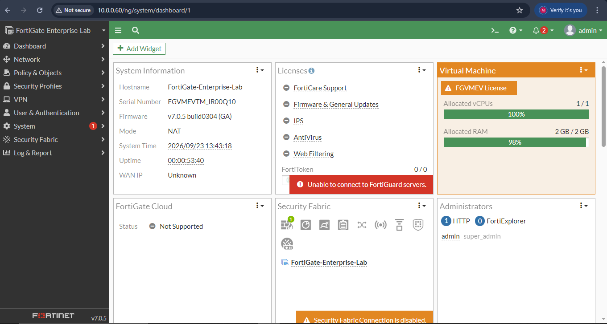

The initial dashboard provides the main FortiGate management interface and serves as the starting point for configuring and monitoring the firewall environment.

It provides access to the main system, network, security, and monitoring components used throughout the lab.

---

### 🌐 Network Interfaces

**Screenshot:** `02-network-interfaces.png`

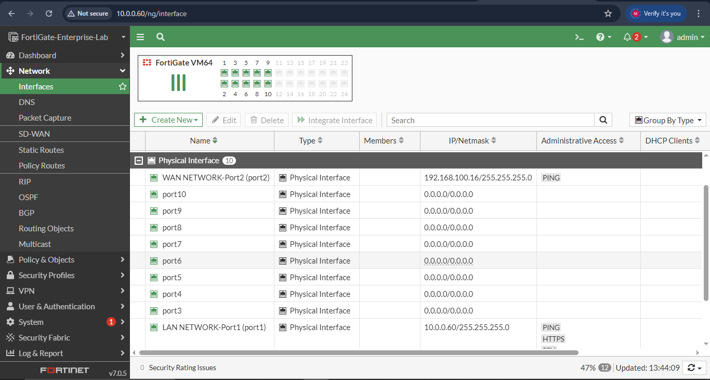

This screenshot displays the configured FortiGate network interfaces and their current configuration.

The interface overview is used to verify the available network ports and their configured roles before applying the remaining network services and security policies.

---

### 🌐 WAN Interface Configuration

**Screenshot:** `03-wan-interface-configuration.png`

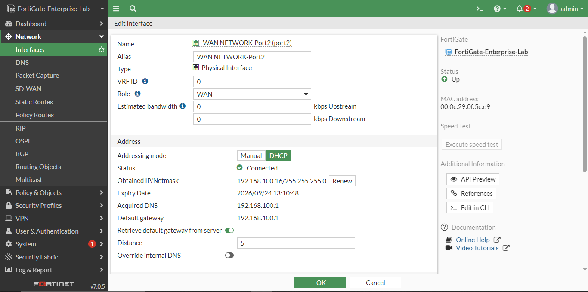

This screenshot shows the configuration of the FortiGate WAN interface.

The interface is used for external network connectivity and provides the connection required for Internet-bound traffic.

---

### 💻 LAN Interface Configuration

**Screenshot:** `04-lan-interface-configuration.png`

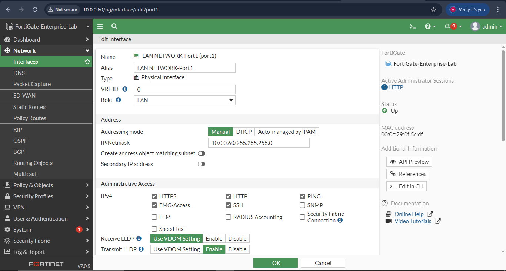

This screenshot shows the FortiGate LAN interface configuration.

The LAN interface provides connectivity for the internal network and is used as a source interface for internal users and their associated security policies.

---

### 🌐 Internet Connectivity Verification

**Screenshot:** `05-internet-connectivity-ping.png`

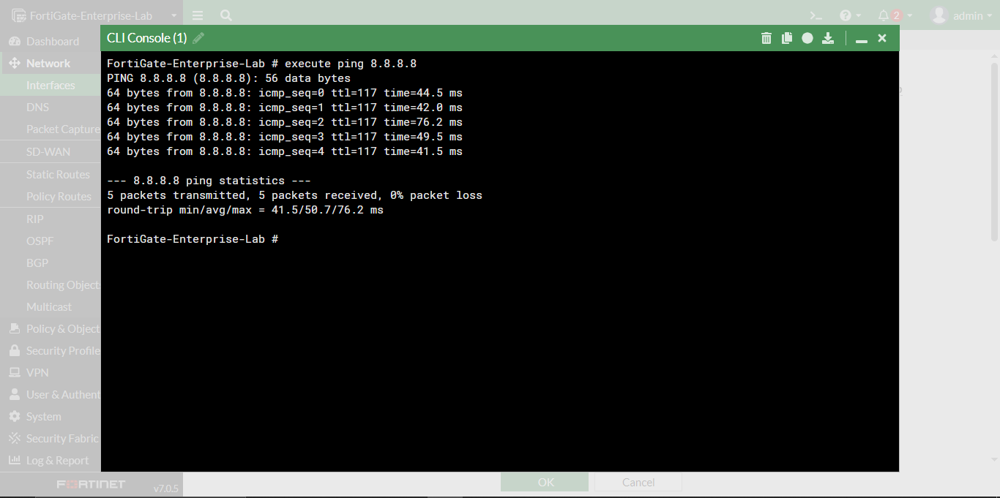

The screenshot shows a connectivity test performed from the FortiGate environment.

The successful response demonstrates that the configured network path is able to reach the tested external destination.

---

### 📡 DHCP Server Configuration

**Screenshot:** `06-dhcp-server-configuration.png`

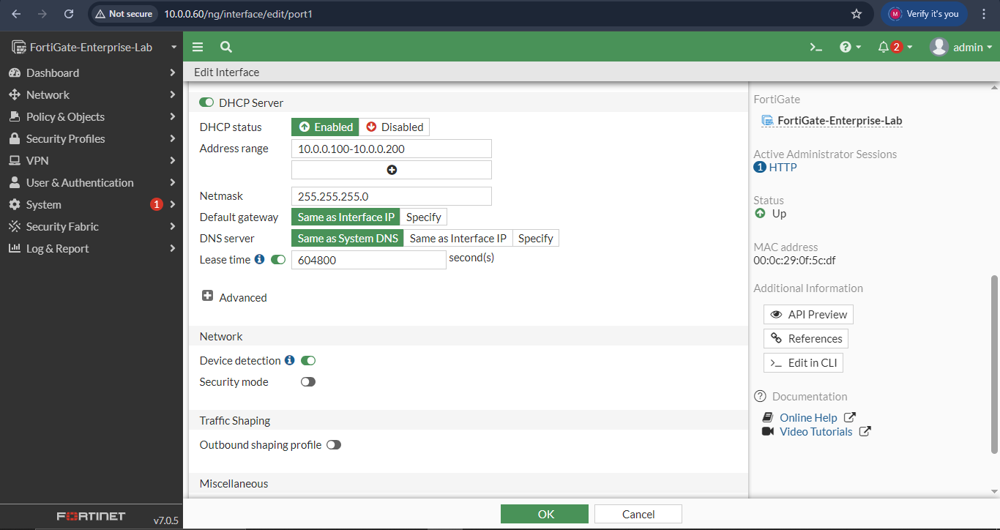

This screenshot shows the DHCP server configuration on the FortiGate.

The DHCP service is responsible for dynamically assigning network configuration to connected clients according to the configured address range and parameters.

---

### 🛣️ Routing Configuration

**Screenshot:** `07-routing-table.png`

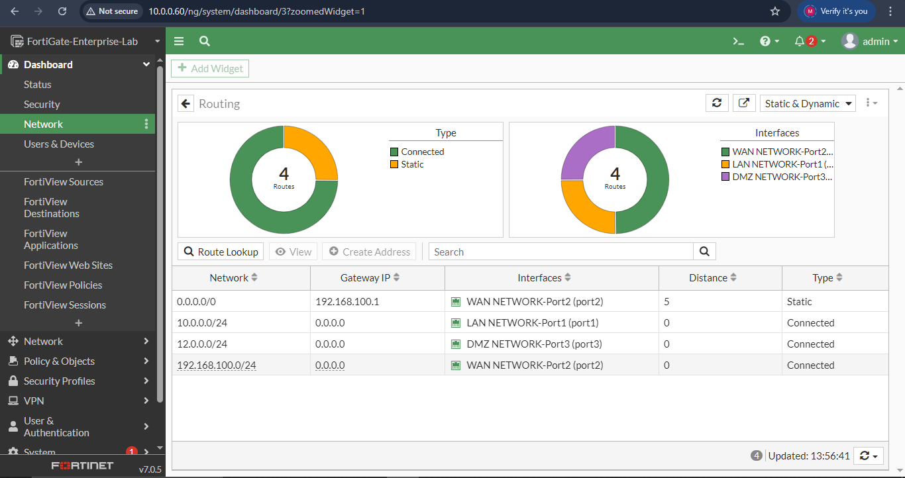

This screenshot displays the FortiGate routing information.

The routing table is used to determine how traffic is forwarded between connected networks and external destinations.

---

> **Configuration Note:**  
> The following sections document the security and traffic-management configurations implemented on top of the initial network configuration.

## 🛡️ Security & Access Control

This section documents the security controls implemented on the FortiGate firewall, including application control, web filtering, firewall policies, administrator access, and protection of the application server.

---

### 🚫 Application Control

**Screenshot:** `08-application-control-profile.png`

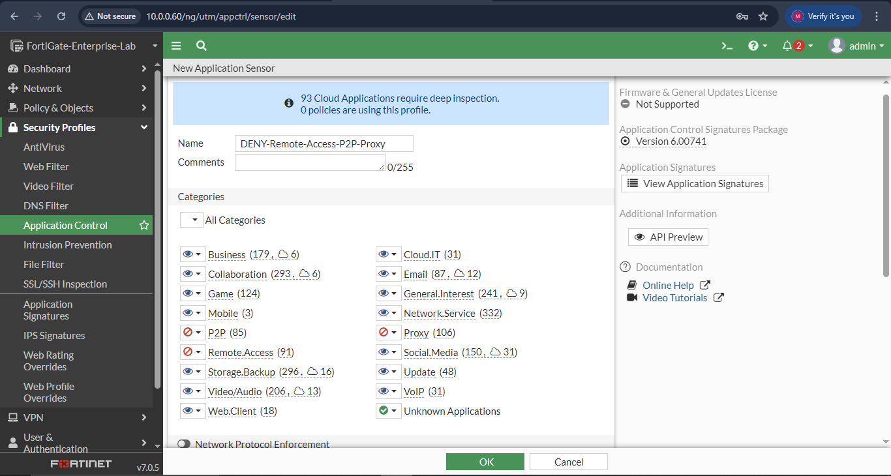

The screenshot shows the configured **Application Control** profile used to identify and control specific types of application traffic.

Application Control provides application-level visibility and allows the firewall to apply security controls to selected applications and traffic categories.

---

### 🌍 Web Filtering

**Screenshot:** `09-web-filter-profile.png`

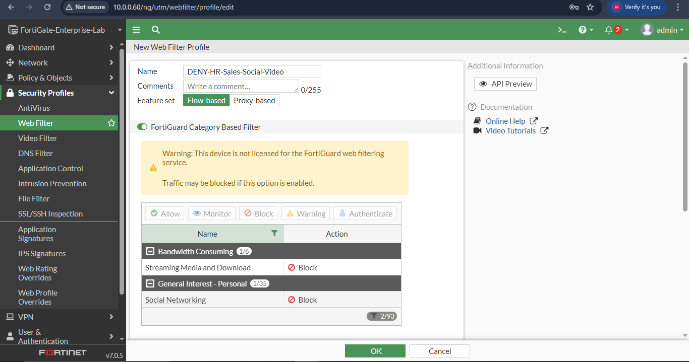

This screenshot shows the configured **Web Filter** profile.

The profile is used to control access to selected websites and web categories according to the security requirements of the environment.

---

### 🛡️ Firewall Policies

**Screenshot:** `10-firewall-policies.png`

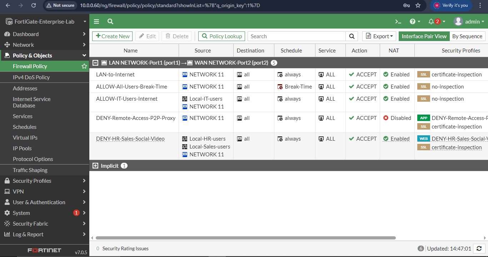

The screenshot displays the configured firewall policies used to control traffic passing through the FortiGate.

Firewall policies define how traffic is handled based on parameters such as source, destination, service, schedule, and security controls.

---

### 🚦 Traffic Shaping Policy

**Screenshot:** `11-traffic-shaping-policy.png`

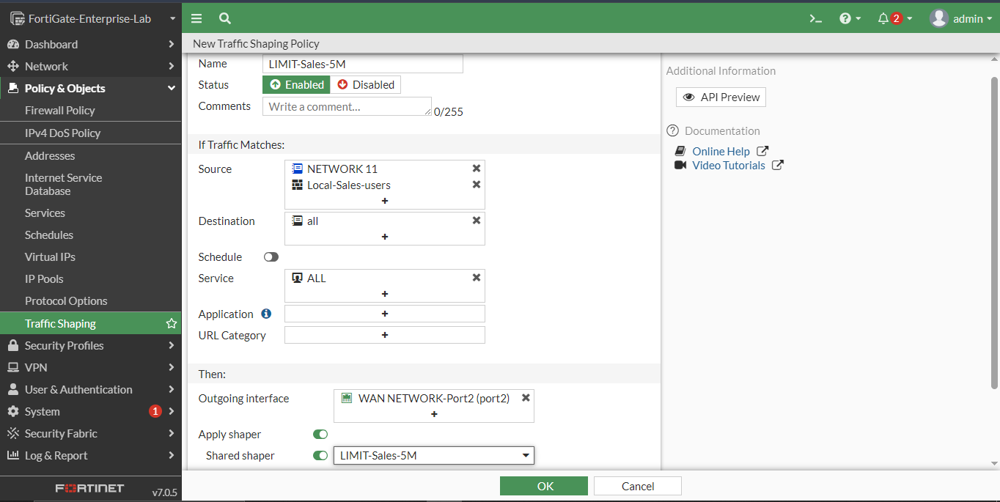

This screenshot shows a firewall policy associated with **traffic shaping**.

Traffic shaping is used to control the amount of bandwidth available to selected traffic according to the configured policy.

---

### 📺 YouTube Traffic Shaping

**Screenshot:** `12-youtube-traffic-shaping-policy.png`

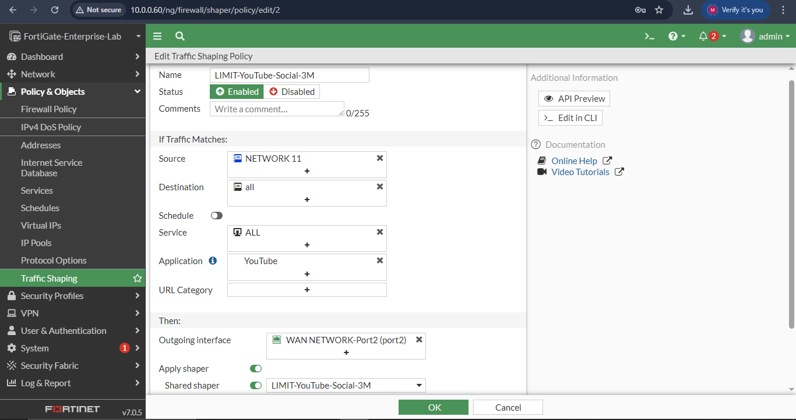

This screenshot shows the policy used to apply traffic management to **YouTube-related traffic**.

The configuration demonstrates the use of application-aware traffic control to manage bandwidth for selected application traffic.

---

### 👤 IT Help Desk Administrator

**Screenshot:** `13-it-helpdesk-admin.png`

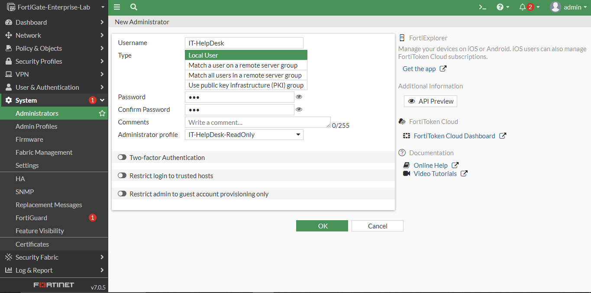

The screenshot shows the configured **IT Help Desk** administrator account.

The account is associated with the restricted administrator profile:

`IT-HelpDesk-ReadOnly`

This provides a dedicated administrative identity for controlled access to the FortiGate management environment.

---

### 🔄 Application Server NAT / VIP

**Screenshot:** `14-dnat-app-server-vip.png`

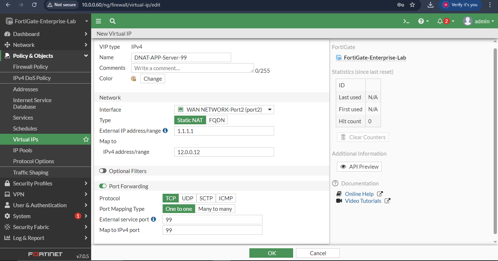

The screenshot shows the configured **VIP / DNAT** entry for the application server.

The visible configuration maps the external service to the protected application server in the internal network.

This configuration allows traffic received on the configured external address and port to be forwarded to the corresponding internal server and port.

---

### 🛡️ Application Server Protection

**Screenshot:** `15-allow-app-server-policy.png`

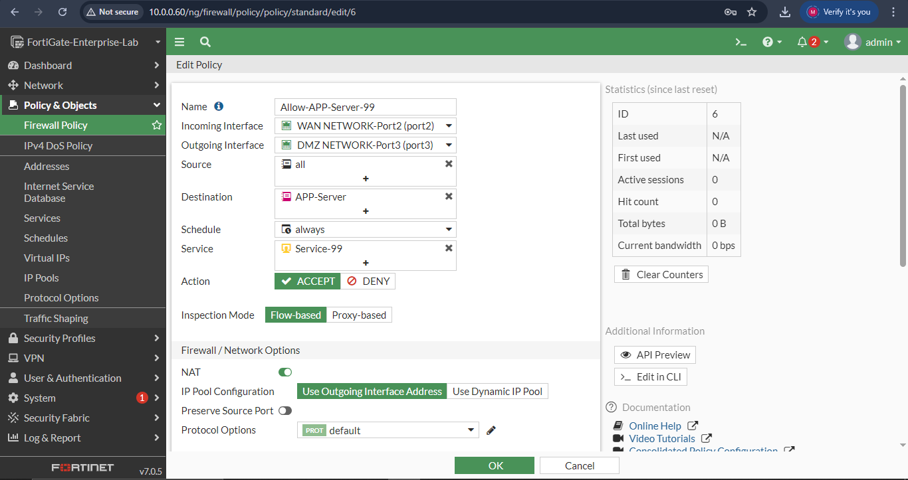

This screenshot shows the firewall policy associated with access to the application server.

The policy provides controlled access to the protected server while applying the configured security controls, including the visible **IPS** profile.

The combination of the VIP configuration and firewall policy provides controlled publication and protection of the application service.

---

> **Security Note:**  
> The security controls documented in this section work together to provide application-level control, web access filtering, traffic management, administrator access control, and protection for the published application server.

## 🔐 VPN & FortiGate 2

This section documents the IPsec VPN configuration and the second FortiGate device used in the lab environment.

The screenshots provide visual evidence of the VPN wizard configuration, FortiGate 2 network interfaces, connectivity verification, and IPsec tunnel status.

---

### 🔐 IPsec VPN Configuration

**Screenshot:** `16-ipsec-vpn-setup-complete.png`

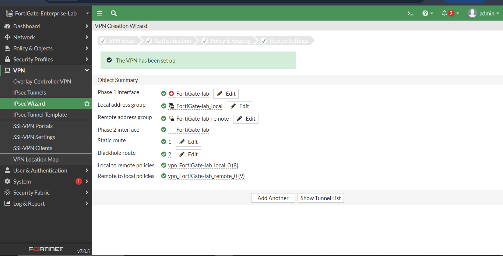

The screenshot shows the completed **IPsec VPN Wizard** configuration on the FortiGate.

The wizard summary displays the configured VPN parameters, including the participating interfaces, local and remote network objects, Phase 1 and Phase 2 configuration references, and the resulting VPN configuration.

This configuration establishes the required parameters for secure IPsec communication between the configured FortiGate endpoints.

---

### 🛡️ FortiGate 2 Network Interfaces

**Screenshot:** `17-fortigate2-network-interfaces.png`

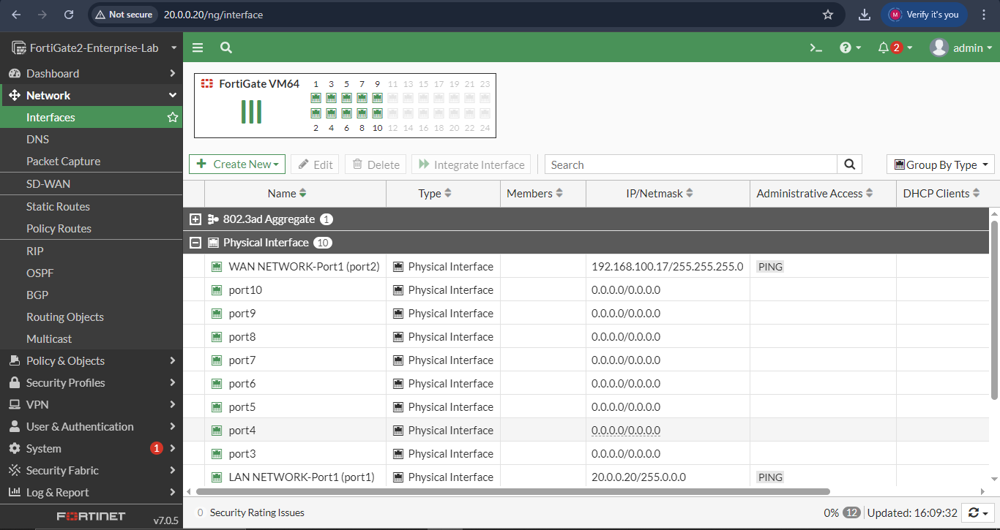

This screenshot displays the network interfaces configured on **FortiGate 2**.

The interface table provides visibility into the available physical interfaces, their configured IP addresses, interface types, and administrative access settings where shown.

This configuration provides the network foundation required for FortiGate 2 to participate in the lab environment and establish VPN connectivity.

---

### 🌐 FortiGate 2 Internet Connectivity

**Screenshot:** `18-fortigate2-internet-connectivity-ping.png`

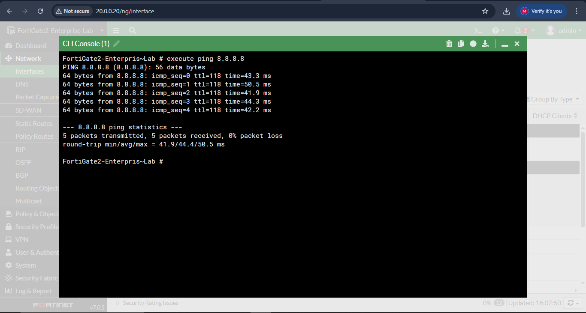

The screenshot shows a connectivity test performed from the FortiGate 2 CLI.

The displayed ping results provide evidence that FortiGate 2 can reach the tested external destination and receive responses successfully.

This verifies external network connectivity from the second FortiGate device.

---

### 🔐 IPsec Tunnel Status — FortiGate 1

**Screenshot:** `19-ipsec-tunnels-status.png`

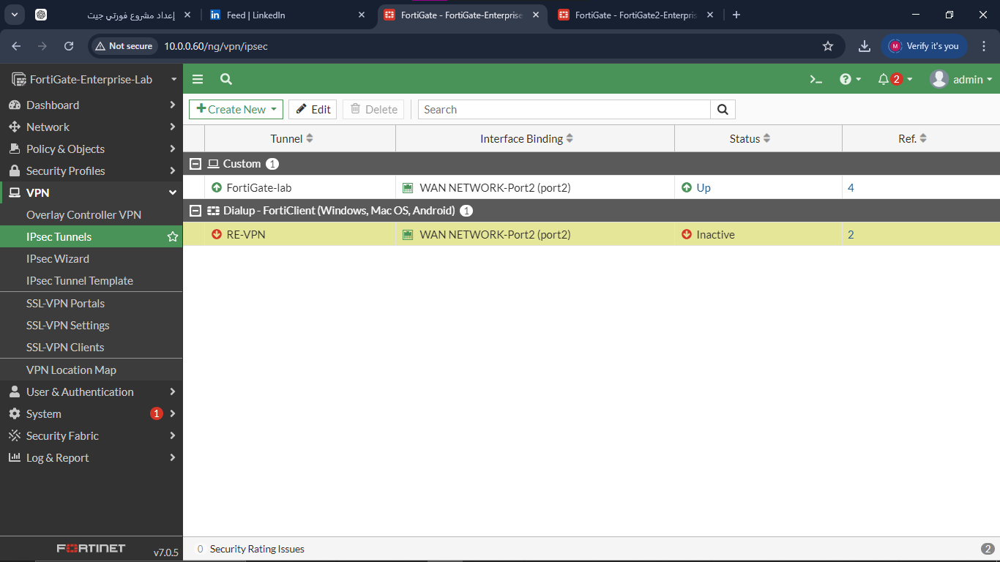

The screenshot displays the configured IPsec tunnels on the first FortiGate device.

The IPsec tunnel list provides visibility into the configured tunnel names, interface bindings, and their current status at the time the screenshot was captured.

The screenshot also shows the configured **FortiClient Dialup VPN** entry separately from the custom site-to-site IPsec tunnel.

---

### 🔐 IPsec Tunnel Status — FortiGate 2

**Screenshot:** `20-fortigate2-ipsec-tunnel-status.png`

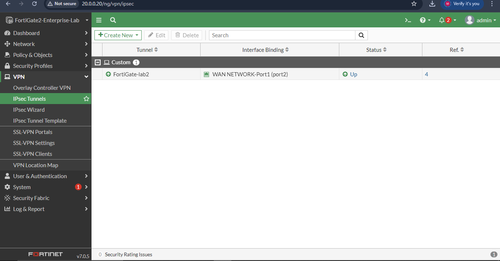

This screenshot displays the IPsec tunnel configuration on **FortiGate 2**.

It provides visual evidence of the configured site-to-site IPsec tunnel, its interface binding, and the tunnel status shown at the time of capture.

---

> **🔎 VPN Verification Note:**  
> The initial VPN screenshots document the configuration and tunnel state during the implementation process. Final tunnel verification is documented separately in the final verification section using the later screenshots that show the site-to-site IPsec tunnels in an **Up** state.

---

## ⚙️ Final Security & Configuration

This section documents the final security, access-control, traffic-management, system, and backup configurations implemented on the FortiGate firewall.

---

### 🛡️ Firewall Policies Overview

**Screenshot:** `21-firewall-policies-overview.png`

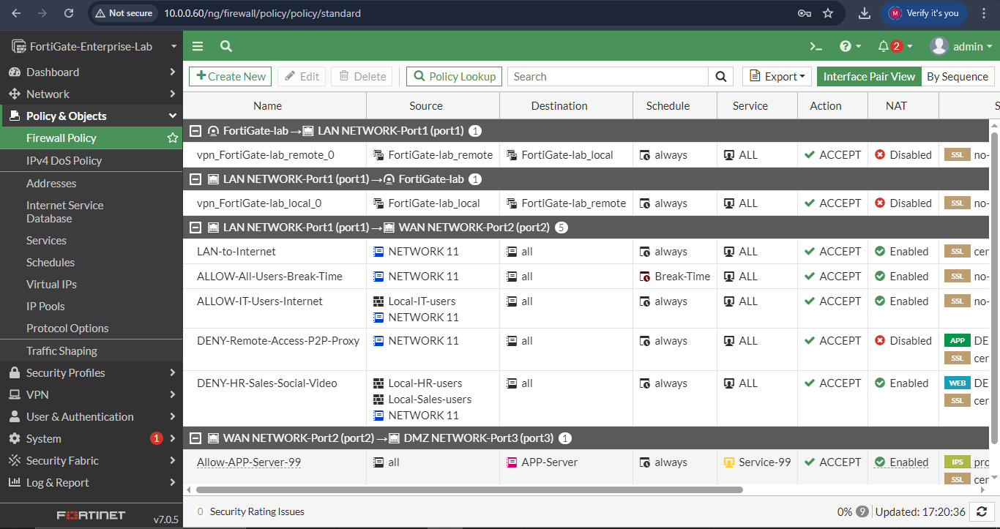

The screenshot provides an overview of the main firewall policies configured on the FortiGate.

The visible policies include controls for:

- ⏰ Break-time Internet access
- 👥 IT user Internet access
- 🚫 Remote-access, P2P, and proxy traffic
- 🌐 Social media and video streaming restrictions for HR and Sales users
- 🖥️ Application Server access

The screenshot also shows the associated schedules, services, actions, NAT status, and visible security profiles.

---

### ⏰ Break-Time Schedule

**Screenshot:** `22-break-time-schedule.png`

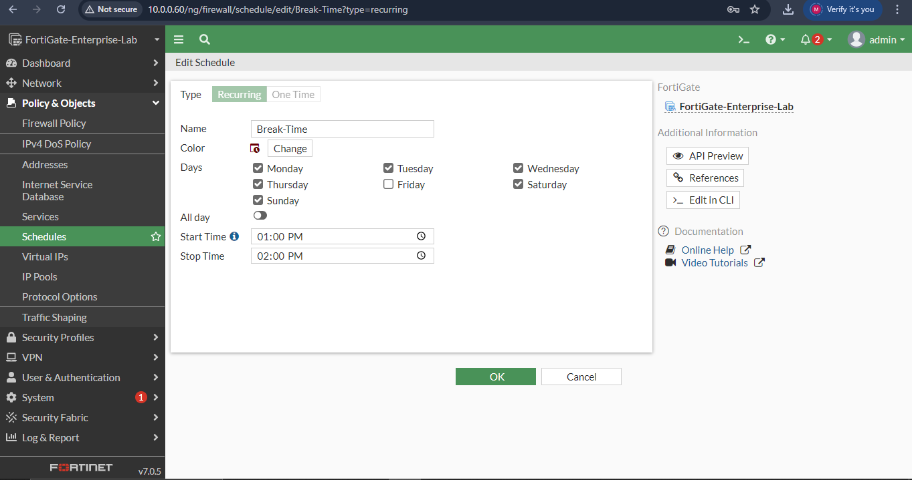

The screenshot shows the recurring **Break-Time** schedule configured on the FortiGate.

The visible schedule is configured with:

- **Type:** Recurring
- **Start Time:** 01:00 PM
- **Stop Time:** 02:00 PM

The schedule is used by the corresponding firewall policy to define the time period during which the configured access rule is active.

---

### 🚦 Traffic Shapers

**Screenshot:** `23-traffic-shapers.png`

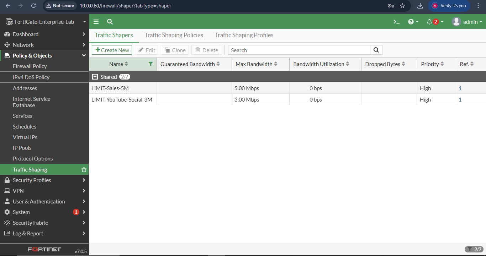

The screenshot displays the configured shared traffic shapers used to control bandwidth consumption.

The visible configurations are:

| Traffic Shaper | Maximum Bandwidth |
|---|---:|
| `LIMIT-Sales-5M` | 5.00 Mbps |
| `LIMIT-YouTube-Social-3M` | 3.00 Mbps |

These traffic shapers provide bandwidth control for the specified traffic according to their associated firewall policies.

---

### 👥 Local User Groups

**Screenshot:** `24-local-users-groups.png`

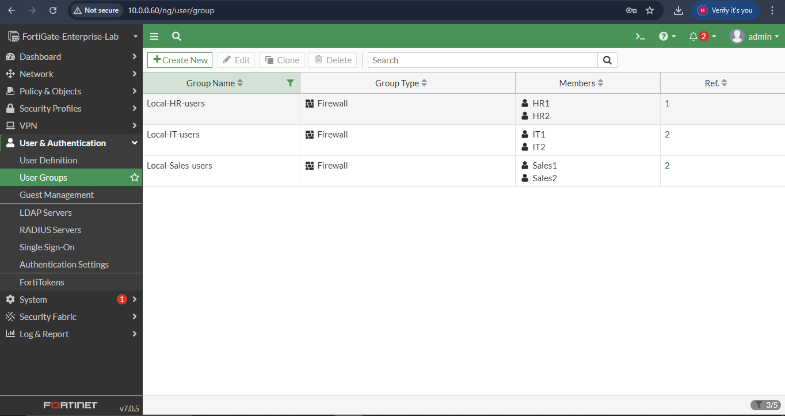

The screenshot displays the local firewall user groups configured on the FortiGate.

| Group | Members |
|---|---|
| `Local-HR-users` | HR1, HR2 |
| `Local-IT-users` | IT1, IT2 |
| `Local-Sales-users` | Sales1, Sales2 |

These groups provide an identity-based structure that can be referenced by firewall policies and access-control rules.

---

### 👤 IT Help Desk — Read-Only Administrator

**Screenshot:** `25-it-helpdesk-readonly.png`

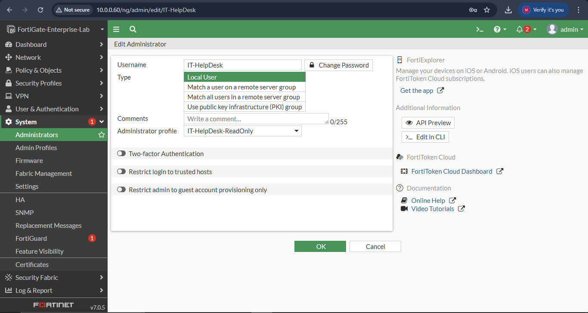

The screenshot shows the administrator configuration for the dedicated IT Help Desk account.

| Parameter | Value |
|---|---|
| Username | `IT-HelpDesk` |
| Type | `Local User` |
| Administrator Profile | `IT-HelpDesk-ReadOnly` |

The dedicated administrator profile is intended to provide restricted administrative access according to the permissions assigned to the profile.

---

### 🕒 System Settings

**Screenshot:** `26-fw1-cairo-settings.png`

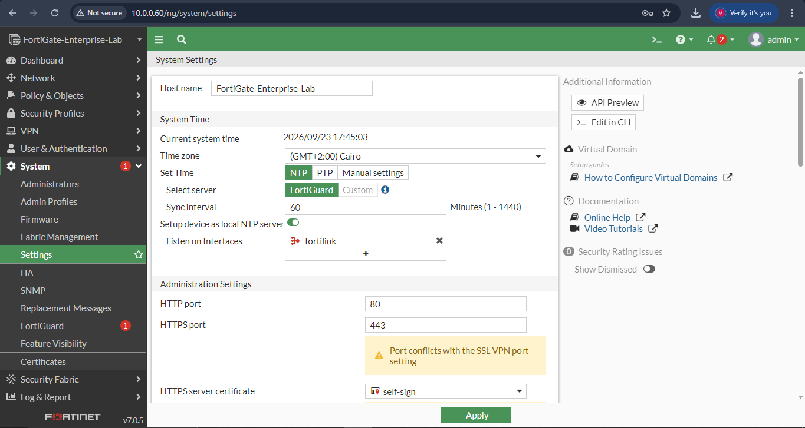

The screenshot displays the FortiGate system settings.

The visible configuration includes:

| Parameter | Value |
|---|---|
| Host Name | `FortiGate-Enterprise-Lab` |
| Time Zone | `(GMT+2:00) Cairo` |

The configured Cairo time zone ensures that the firewall system time is aligned with the selected regional time zone.

---

### 💾 Encrypted Configuration Backup

**Screenshot:** `27-encrypted-config-backup.png`

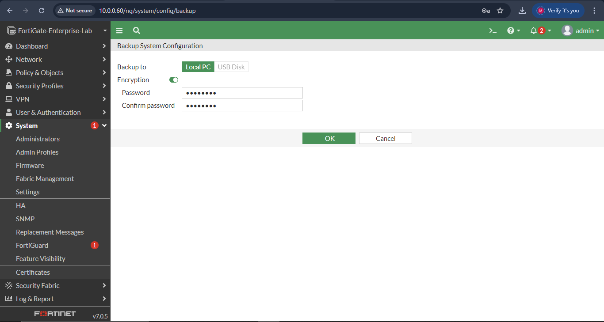

The screenshot shows the FortiGate **Backup System Configuration** interface.

The visible settings include:

| Parameter | Configuration |
|---|---|
| Backup Destination | Local PC |
| Encryption | Enabled |
| Password | Configured |
| Confirm Password | Configured |

The encryption option protects the exported firewall configuration and requires the configured password when accessing the encrypted backup.

> 🔒 **Security Note:**  
> The actual backup password is intentionally not displayed or documented.

---

## ✅ Final Verification

This section provides the final verification evidence for the completed FortiGate lab configuration.

---

### 🔐 Site-to-Site IPsec VPN — FortiGate 1

**Screenshot:** `28-site-to-site-vpn-fw1-up.png`

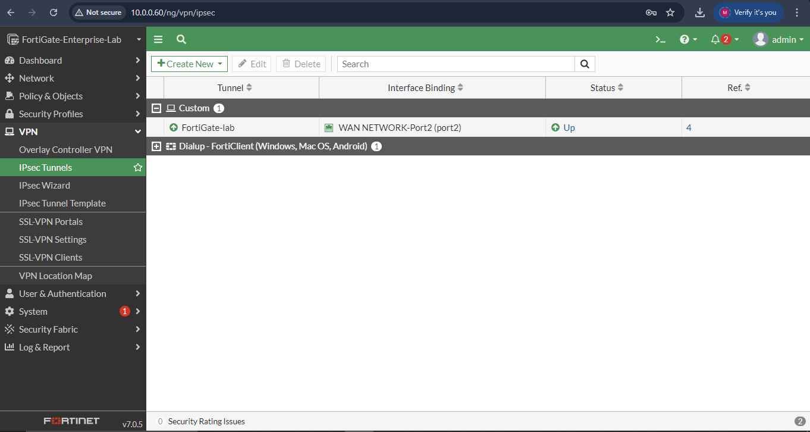

The screenshot shows the configured `FortiGate-lab` IPsec tunnel on the first FortiGate device.

**Tunnel Status:** 🟢 **Up**

The displayed status confirms that the site-to-site IPsec tunnel is established on FortiGate 1 at the time of capture.

---

### 🔐 Site-to-Site IPsec VPN — FortiGate 2

**Screenshot:** `29-site-to-site-vpn-fw2-up.png`

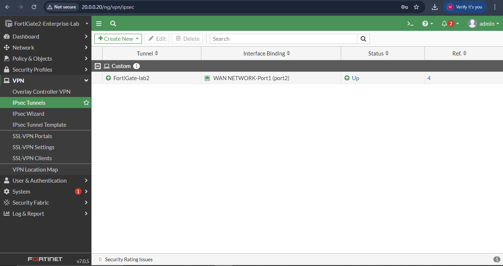

The screenshot shows the corresponding `FortiGate-lab2` IPsec tunnel on the second FortiGate device.

**Tunnel Status:** 🟢 **Up**

The displayed status confirms that the site-to-site IPsec tunnel is established on FortiGate 2 at the time of capture.

---

## 📋 Configuration Verification Matrix

| Area | Evidence | Status |
|---|---|:---:|
| 🖥️ Initial FortiGate Configuration | Screenshots 01–04 | ✅ |
| 🌐 Internet Connectivity | Screenshots 05, 18 | ✅ |
| 📡 DHCP Configuration | Screenshot 06 | ✅ |
| 🛣️ Routing | Screenshot 07 | ✅ |
| 🚫 Application Control | Screenshot 08 | ✅ |
| 🌍 Web Filtering | Screenshot 09 | ✅ |
| 🛡️ Firewall Policies | Screenshots 10, 21 | ✅ |
| 🚦 Traffic Shaping | Screenshots 11, 12, 23 | ✅ |
| 👤 Administrator Access | Screenshots 13, 25 | ✅ |
| 🔄 NAT / VIP | Screenshot 14 | ✅ |
| 🛡️ Application Server Protection | Screenshot 15 | ✅ |
| 🔐 IPsec VPN Configuration | Screenshots 16, 19, 20 | ✅ |
| 👥 Local User Groups | Screenshot 24 | ✅ |
| ⏰ Break-Time Schedule | Screenshot 22 | ✅ |
| 🕒 System Time Zone | Screenshot 26 | ✅ |
| 💾 Encrypted Backup | Screenshot 27 | ✅ |
| 🔐 Site-to-Site VPN — FW1 | Screenshot 28 | 🟢 Up |
| 🔐 Site-to-Site VPN — FW2 | Screenshot 29 | 🟢 Up |

---

## 📸 Screenshot Gallery

### 🖥️ Core Configuration

| # | Screenshot |
|---:|---|
| 01 | `01-initial-dashboard.png` |
| 02 | `02-network-interfaces.png` |
| 03 | `03-wan-interface-configuration.png` |
| 04 | `04-lan-interface-configuration.png` |
| 05 | `05-internet-connectivity-ping.png` |
| 06 | `06-dhcp-server-configuration.png` |
| 07 | `07-routing-table.png` |

### 🛡️ Security & Access Control

| # | Screenshot |
|---:|---|
| 08 | `08-application-control-profile.png` |
| 09 | `09-web-filter-profile.png` |
| 10 | `10-firewall-policies.png` |
| 11 | `11-traffic-shaping-policy.png` |
| 12 | `12-youtube-traffic-shaping-policy.png` |
| 13 | `13-it-helpdesk-admin.png` |
| 14 | `14-dnat-app-server-vip.png` |
| 15 | `15-allow-app-server-policy.png` |

### 🔐 VPN & FortiGate 2

| # | Screenshot |
|---:|---|
| 16 | `16-ipsec-vpn-setup-complete.png` |
| 17 | `17-fortigate2-network-interfaces.png` |
| 18 | `18-fortigate2-internet-connectivity-ping.png` |
| 19 | `19-ipsec-tunnels-status.png` |
| 20 | `20-fortigate2-ipsec-tunnel-status.png` |

### ⚙️ Final Configuration & Verification

| # | Screenshot |
|---:|---|
| 21 | `21-firewall-policies-overview.png` |
| 22 | `22-break-time-schedule.png` |
| 23 | `23-traffic-shapers.png` |
| 24 | `24-local-users-groups.png` |
| 25 | `25-it-helpdesk-readonly.png` |
| 26 | `26-fw1-cairo-settings.png` |
| 27 | `27-encrypted-config-backup.png` |
| 28 | `28-site-to-site-vpn-fw1-up.png` |
| 29 | `29-site-to-site-vpn-fw2-up.png` |

---

## 🏁 Project Completion

This project documents the implementation and verification of the FortiGate Enterprise Firewall Lab through configuration screenshots and technical documentation.

 

### 👨‍💻 Mohanad Mahmoud

<a href="https://www.linkedin.com/in/mohanad-mahmoud-it">
  LinkedIn
</a>

